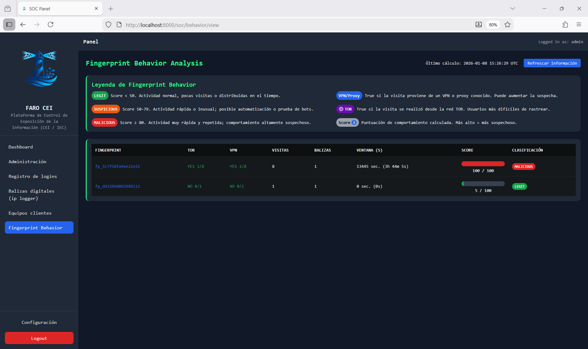
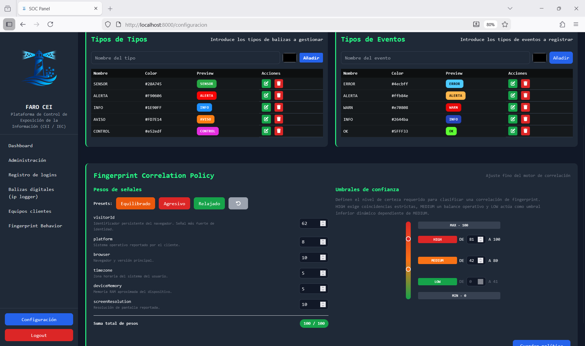

# FARO-CEI
Plataforma de Behavioral Information Exposure Control que permite identificar, correlacionar y evaluar el acceso persistente a información expuesta mediante análisis de comportamiento, fingerprints y señales contextuales, sin fricción ni agentes.

# Plataforma de Control de Exposición de la Información  
**CEI / IEC — Control de Exposición de la Información**

---

## Descripción

La **Plataforma de Control de Exposición de la Información (CEI / IEC)** es una aplicación web diseñada para **detectar, analizar y controlar la exposición involuntaria de información** mediante el uso de balizas, fingerprinting y correlación de eventos.

Su propósito es ofrecer **visibilidad operativa y trazabilidad** sobre accesos no controlados, reutilización de información y pérdida de control del dato, tanto en entornos internos como externos.

CEI no sustituye a un SIEM, un SOC ni a un DLP tradicional. Se posiciona como una **capa complementaria especializada en la exposición informacional**, aportando contexto, correlación y control activo.

---

## ¿Qué problema resuelve?

CEI permite responder de forma fiable a cuestiones clave como:

- ¿Quién ha accedido a una información que ya no debería estar activa?
- ¿Desde qué ubicación, red o entorno se ha producido el acceso?
- ¿Se está reutilizando un enlace, documento o artefacto fuera de su canal previsto?
- ¿Existen patrones de acceso correlacionados entre eventos aislados?
- ¿Estoy perdiendo control sobre información ya distribuida?

---

## Funcionalidades principales

### 1. Balizas (Beacons)

- Creación y gestión de balizas de seguimiento.
- Registro automático de accesos a recursos monitorizados.
- Captura de información contextual:
  - IP pública
  - User-Agent
  - Fecha y hora
  - IP local y hostname (cuando es posible)
- Uso habitual:
  - Documentos
  - Enlaces
  - Recursos compartidos
  - Artefactos de auditoría o prueba

---

### 2. Fingerprinting y correlación

- Generación de fingerprints basados en comportamiento.
- Agrupación lógica de eventos relacionados.
- Detección de:
  - Reutilización de balizas
  - Persistencia de accesos
  - Patrones anómalos
- Clasificación por nivel de confianza:
  - **HIGH**
  - **MEDIUM**
  - **LOW** (calculado automáticamente)

---

### 3. Umbrales de confianza dinámicos

- Definición visual e interactiva de umbrales.
- Reglas de consistencia:
  - HIGH y MEDIUM configurables por el usuario.
  - LOW se calcula automáticamente como rango inferior dependiente de MEDIUM.
- Representación visual:
  - Barra vertical con gradiente
  - Marcadores sincronizados
  - Rangos numéricos dinámicos
- Validaciones automáticas para evitar configuraciones inconsistentes.

---

### 4. Centro de actividad y análisis

- Panel centralizado de eventos.
- Línea temporal de accesos.
- Vista detallada por fingerprint.
- Indicadores de riesgo:
  - Uso de VPN
  - Uso de TOR
  - Repetición de comportamiento
- Enfoque analítico y operativo, orientado a contexto y correlación.

---

### 5. Autenticación y control de acceso

- Autenticación mediante usuario administrador.
- Contraseñas almacenadas de forma segura (**hash PBKDF2 – werkzeug.security**).
- Protección contra fuerza bruta:
  - Detección de intentos repetidos
  - Bloqueo temporal
  - Registro de eventos
- **Cambio obligatorio de contraseña** si se detectan credenciales por defecto.
- Registro de intentos de login exitosos y fallidos.

---

### 6. Registro y auditoría

- Logging estructurado de:
  - Accesos
  - Eventos de bloqueo
  - Autenticaciones
- Persistencia en CSV y JSON ligeros.
- Diseño auditable y trazable, sin dependencias pesadas.

---

## Enfoque de seguridad

- Arquitectura defensiva y controlada.
- Dependencias mínimas.
- Pensado para:
  - Blue Team
  - Auditoría interna
  - Investigación de fugas
  - Análisis post-incidente
- Bajo impacto, fácil despliegue y mantenimiento.

---

## ¿Qué NO es CEI?

- ❌ No es un SIEM  
- ❌ No es un SOC  
- ❌ No es una plataforma OSINT  
- ❌ No es un DLP tradicional  

CEI complementa estas soluciones aportando **control activo sobre la exposición de la información**, no solo monitorización pasiva.

---

## Casos de uso

- Auditoría de documentos compartidos
- Seguimiento de enlaces sensibles
- Control de información distribuida
- Pruebas de fuga controladas
- Investigación forense ligera
- Entornos Red Team / Blue Team

---

## Requisitos

- Python 3.10+
- Flask
- Navegador moderno
- Entorno local o servidor interno

*(No requiere base de datos externa)*

---

## Instalación básica

```bash
git clone https://github.com/informaticaeloy/faro-cei.git
cd faro-cei
python -m venv venv
source venv/bin/activate  # Windows: venv\Scripts\activate
pip install -r requirements.txt
python main.py
python main.py
```

## 📸 Capturas

### Login seguro


### Dashboard operativo


### Correlación de fingerprint


### Umbrales de confianza

